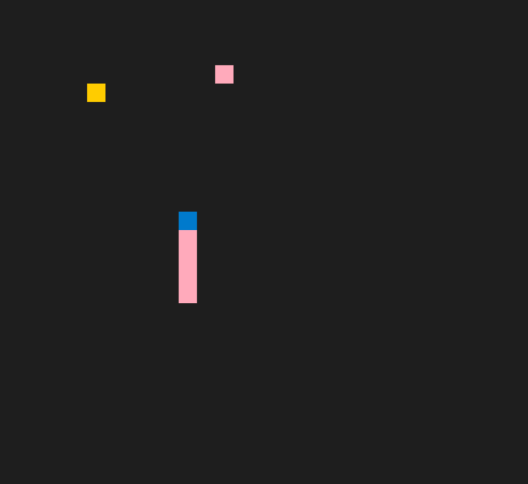

# CPPND: Capstone Snake Game Example

This is a starter repo for the Capstone project in the [Udacity C++ Nanodegree Program](https://www.udacity.com/course/c-plus-plus-nanodegree--nd213). The code for this repo was inspired by [this](https://codereview.stackexchange.com/questions/212296/snake-game-in-c-with-sdl) excellent StackOverflow post and set of responses.

The Capstone Project gives you a chance to integrate what you've learned throughout this program. This project will become an important part of your portfolio to share with current and future colleagues and employers.

In this project, you can build your own C++ application or extend this Snake game, following the principles you have learned throughout this Nanodegree Program. This project will demonstrate that you can independently create applications using a wide range of C++ features.

## Dependencies for Running Locally
* cmake >= 3.7
  * All OSes: [click here for installation instructions](https://cmake.org/install/)
* make >= 4.1 (Linux, Mac), 3.81 (Windows)
  * Linux: make is installed by default on most Linux distros
  * Mac: [install Xcode command line tools to get make](https://developer.apple.com/xcode/features/)
  * Windows: [Click here for installation instructions](http://gnuwin32.sourceforge.net/packages/make.htm)
* SDL2 >= 2.0
  * All installation instructions can be found [here](https://wiki.libsdl.org/Installation)
  >Note that for Linux, an `apt` or `apt-get` installation is preferred to building from source. 
* gcc/g++ >= 5.4
  * Linux: gcc / g++ is installed by default on most Linux distros
  * Mac: same deal as make - [install Xcode command line tools](https://developer.apple.com/xcode/features/)
  * Windows: recommend using [MinGW](http://www.mingw.org/)

## Basic Build Instructions

1. Clone this repo.
2. Make a build directory in the top level directory: `mkdir build && cd build`
3. Compile: `cmake .. && make`
4. Run it: `./SnakeGame`.

## Project Rubric
1. Loops, Functions, I/O
  * Accepts user inputs from keyboard (Controller class)
  * Game::run is a while loop function, it breaks when the snake died (Game over)
2. Object Oriented Programming
  * Game class is the main class, it contains and creates a Snake class
  * Game class is responsible for simulate and update the snake object
  * Classes use access specifiers for methods and data members (Snake class)
  * Classes use initialization list (Snake class)
3. Memory management
  * Added copy constructor, copy assignment constructor, move constructor, move assignment constructor to Snake class, follows the Rule of 5
  * Changed the Render method to accepts snake reference rather than making a copy
4. Cocurrency
  * Changed one food to two foods
  * Simutaneously place two foods in two separate threads (game.cpp, Game::PlaceFood_thread) and then join the threads
5. Game functionalities change
  * Changed the Cmake to link to pthread
  * Added the behavior that when the snake's new head hits the wall, mark it as died, also revert snake head to the location before hitting the wall and stop here
  * Added another foods, the snake can eat either of them and grow its body, place two food simutaneously using threads
  * Render color of the snake body depends on which food it just ate

## CC Attribution-ShareAlike 4.0 International
Shield: [![CC BY-SA 4.0][cc-by-sa-shield]][cc-by-sa]

This work is licensed under a
[Creative Commons Attribution-ShareAlike 4.0 International License][cc-by-sa].

[![CC BY-SA 4.0][cc-by-sa-image]][cc-by-sa]

[cc-by-sa]: http://creativecommons.org/licenses/by-sa/4.0/
[cc-by-sa-image]: https://licensebuttons.net/l/by-sa/4.0/88x31.png
[cc-by-sa-shield]: https://img.shields.io/badge/License-CC%20BY--SA%204.0-lightgrey.svg
