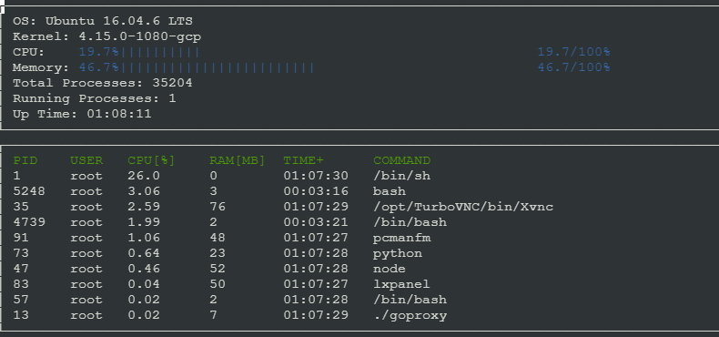
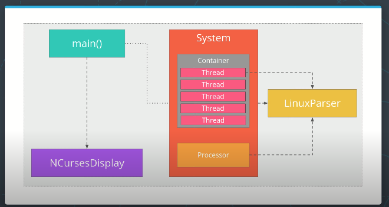

# CppND-System-Monitor

Finished code for System Monitor Project in the Object Oriented Programming Course of the [Udacity C++ Nanodegree Program](https://www.udacity.com/course/c-plus-plus-nanodegree--nd213). 

Here is a screenshot of the running monitor

## ncurses library
[ncurses](https://www.gnu.org/software/ncurses/) is a library that facilitates text-based graphical output in the terminal. This project relies on ncurses for display output.

Within the Udacity Workspace, `.student_bashrc` automatically installs ncurses every time you launch the Workspace.

If you are not using the Workspace, install ncurses within your own Linux environment: `sudo apt install libncurses5-dev libncursesw5-dev`

## Make
This project uses [Make](https://www.gnu.org/software/make/). The Makefile has four targets:
* `build` compiles the source code and generates an executable
* `format` applies [ClangFormat](https://clang.llvm.org/docs/ClangFormat.html) to style the source code
* `debug` compiles the source code and generates an executable, including debugging symbols
* `clean` deletes the `build/` directory, including all of the build artifacts

## Project

1. Starter code is cloned from the Udacity project repository: `git clone https://github.com/udacity/CppND-System-Monitor-Project-Updated.git`

2. Project structure

3. Implemented the `System`, `Process`, and `Processor` classes, as well as functions within the `LinuxParser` namespace.

4. Build the project: `make build`

5. Run the resulting executable: `./build/monitor`

